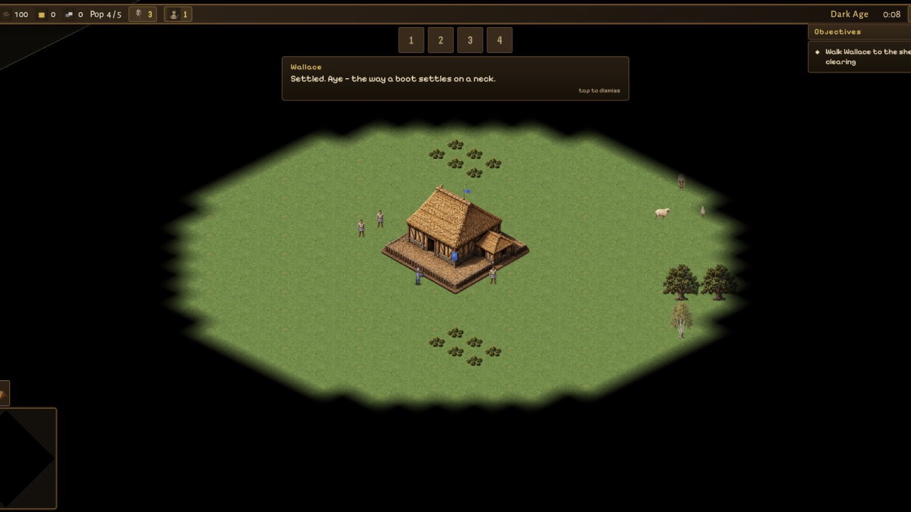

<div align="center">
  
  <h1>StoneSiege</h1>
  <p><strong>Build a kingdom. Raise an army. Rewrite history.</strong></p>
  <p>An AI-native, open-source historical real-time strategy game for browser, Android, and iOS.</p>
  <p>
    <a href="https://stonesiegegame.com">Website</a> ·
    <a href="https://play.stonesiegegame.com">Play in browser</a> ·
    <a href="CONTRIBUTING.md">Contributing</a> ·
    <a href="#start-a-contribution-with-an-ai-coding-agent">AI agent prompt</a> ·
    <a href="ROADMAP.md">Roadmap</a> ·
    <a href="https://github.com/Knorcedger/stonesiege/discussions">Discussions</a> ·
    <a href="https://github.com/Knorcedger/stonesiege/issues/new?template=bug_report.yml">Report a bug</a>
  </p>
  <p>
    <a href="https://github.com/Knorcedger/stonesiege/actions/workflows/ci.yml"></a>
    
    
    
    
  </p>
</div>



StoneSiege is a mobile-first RTS inspired by the depth and clarity of classic historical strategy games. Gather resources, advance through the ages, build fortified settlements, command historically distinct armies, and fight through 48 playable campaign chapters.

The game is built in public and welcomes both traditional and AI-assisted contributors. The current single-player game will remain free. If an official multiplayer edition becomes viable, the present direction is a fair one-time purchase—no subscriptions, loot boxes, or pay-to-win mechanics.

StoneSiege began as a fully vibe-coded experiment and grew into a tested game with a deterministic simulation, native mobile builds, and hundreds of automated checks. We treat AI as a powerful tool, while people remain responsible for design judgment, review, provenance, security, and everything that ships.

> StoneSiege is an independent original project. It is not affiliated with, endorsed by, or sponsored by Microsoft or the Age of Empires franchise.

## Current state

StoneSiege is an **alpha**. The web build is public, while Android and iOS builds are available to invited internal testers. It already includes:

- Public browser play at [play.stonesiegegame.com](https://play.stonesiegegame.com)
- Practice matches against one to three deterministic bots across seven difficulty levels, from Beginner to Hardcore
- Seven historical campaigns with 48 chapters, including the twelve-chapter *William Wallace: The Rising of Scotland*
- Seven civilizations: Scots, English, Vikings, French, Mongols, Byzantines, and Saracens
- Villagers, resources, construction, production, technology, conversion, garrisoning, and fog of war
- Counter-based combat with ranged projectiles, siege, gates, fortifications, armor classes, and multiple victory conditions
- Procedurally connected rivers and cliffs that preserve map accessibility
- Touch-first controls plus complete mouse and keyboard support
- Offline web, Android, and iOS builds from one codebase
- A deterministic simulation designed for replays and future lockstep multiplayer

Expect rough edges, balance changes, and save incompatibilities while the project is in alpha. See [project status](docs/PROJECT_STATUS.md) for the honest snapshot.
Contributors can browse every playable chapter in the [campaign and chapter index](docs/CAMPAIGN_INDEX.md).

## Quick start

You need [Node.js 22.12+ or 24+](https://nodejs.org/) and npm. Source artwork
and store screenshots use Git LFS and are excluded from ordinary clones; the
runtime game does not need them.

```bash
git clone --depth 1 https://github.com/Knorcedger/stonesiege.git
cd stonesiege
npm ci
npm run dev
```

Open <http://localhost:5199>.

For visual comparison work, open <http://localhost:5199/?dev=1>. The Settings
screen then includes developer tools for choosing HD or pixel-source artwork
for the next match. Without `?dev=1`, the game always uses the normal HD-first
path and keeps pixel art only as an automatic fallback.

The repository includes HD source art, generated frames, native wrappers, and store media. Contributors working only on the web game can avoid downloading most non-runtime media:

```bash
git clone --filter=blob:none --no-checkout https://github.com/Knorcedger/stonesiege.git
cd stonesiege
git sparse-checkout init --cone
git sparse-checkout set apps packages docs tools
git checkout main
npm ci
npm run dev
```

Use a normal, non-sparse clone when working on native builds. For source-art or
store-publishing work, install [Git LFS](https://git-lfs.com/) and explicitly
hydrate the large media that the repository excludes by default:

```bash
git lfs pull --include="art/**,store/screenshots/**" --exclude=""
```

Run `git fetch --unshallow` if a shallow checkout later needs the complete
history. The LFS rules apply only to source/master art and store media; shipping
runtime atlases remain regular Git files so builds and CI do not spend LFS
bandwidth.

Desktop controls:

- Left-click selects; left-drag selects a group.
- Right-click issues context commands.
- WASD, arrow keys, screen edges, or middle-drag move the camera.
- The mouse wheel zooms.

On touch devices, tap to select or command, drag to pan, pinch to zoom, and long-press then drag to group-select.

## Start a contribution with an AI coding agent

Replace the `TASK` placeholder below, then give the complete prompt to your AI coding agent. The desired outcome is a focused pull request against StoneSiege—not merely a local experiment or a repository copy. A free GitHub account is required before implementation so the contributor can coordinate through an issue, publish the branch, and open the pull request.

```text
You are contributing to StoneSiege, an open-source historical RTS. Do not stop after setup: complete the task and prepare a focused pull request.

CONTRIBUTOR REQUIREMENT
The contributor needs a free GitHub account to coordinate the issue, publish a branch, and open a pull request. Before implementation, confirm that they have an account and are signed in where the issue and pull request will be created. If they do not have an account, limit work to read-only investigation and explain that they must create and sign in to an account before the contribution can begin. Never create an account, request a password, or invent credentials for them.

ISSUE-FIRST COORDINATION — REQUIRED BEFORE IMPLEMENTATION
Every code, campaign, art, audio, balance, test, or documentation contribution must have one GitHub issue before files are changed. The issue is the public coordination record.

1. Search open and closed issues for the same problem or idea:
   gh issue list --repo Knorcedger/stonesiege --state all --search "<keywords>"

2. Search open pull requests for overlapping work:
   gh pr list --repo Knorcedger/stonesiege --state open --search "<keywords>"

3. If a matching issue exists, inspect its assignees, recent comments, and linked pull requests. If someone is actively working on it, coordinate in that issue and do not start a duplicate implementation. If it is available, comment with your intended scope and ask to be assigned or assign yourself when permitted.

4. If no matching issue exists, create one before editing. Describe the player or contributor problem, the proposed focused scope, acceptance criteria, and important tradeoffs. Do not open a duplicate issue merely to satisfy this rule.

5. Record the issue number. Name the branch for it and make the pull request close or reference it. Investigation needed to write or evaluate the issue is allowed; implementation starts only after the issue exists and the overlap check is complete.

TASK
[Describe the bug, feature, campaign, artwork, animation, balance change, or documentation improvement here.]

WORKFLOW
1. If StoneSiege is not already checked out, run:
   git clone --depth 1 https://github.com/Knorcedger/stonesiege.git
   cd stonesiege

2. Read AGENTS.md, README.md, CONTRIBUTING.md, CODE_OF_CONDUCT.md, docs/ARCHITECTURE.md, and the documentation relevant to the task. Follow every nested AGENTS.md file that applies to files you touch.

3. Inspect git status before editing. Preserve existing work; never reset, overwrite, or discard changes you did not create.

4. Use Node.js 22.12+ or 24+, then install and run the project:
   npm ci
   npm run dev
   Verify the game at http://localhost:5199.

5. Work on a dedicated branch unless the user already prepared one:
   git switch -c contrib/<issue-number>-<short-description>
   Never commit directly to main.

6. Implement only the requested change. Keep simulation code deterministic, keep presentation out of packages/sim, avoid unnecessary dependencies, and follow the existing architecture and visual language. New or AI-assisted assets must include provenance and licence information required by CONTRIBUTING.md and ASSET_LICENSE.md.

7. Add or update focused tests. For visible changes, capture before/after screenshots or a short recording.

8. Run the complete quality gate and fix failures caused by the change:
   npm run check

9. Review the diff for correctness, secrets, unrelated formatting, accidental generated files, and undocumented asset provenance.

10. Commit with the Developer Certificate of Origin sign-off:
    git commit -s -m "<imperative summary>"

11. Publish the branch to a Git remote you can write to and open a pull request against Knorcedger/stonesiege:main. Put “Closes #<issue-number>” in the pull-request description, or “Refs #<issue-number>” when the PR deliberately delivers only part of the accepted issue. Never push directly to main. If GitHub authentication or write access is unavailable, do not invent credentials—leave the branch ready and give the owner the exact commands needed to publish it and open the PR.

12. The pull-request description must cover the problem, solution and tradeoffs, tests performed, visual evidence when relevant, material AI assistance, and asset provenance or licensing considerations.

Return a concise summary with the changed files, verification results, commit, and pull-request URL (or the exact remaining publication commands).
```

## How it is built

```text
apps/web ──► @bf/game (PixiJS renderer, input, HUD, menus)
                 │ commands                  │ state + events
                 ▼                           ▼
              @bf/sim ◄── @bf/data      deterministic 20 Hz simulation
                 ▲
          @bf/ai + @bf/scenarios
```

| Area | Responsibility |
|---|---|
| `packages/sim` | Integer-only deterministic rules and systems |
| `packages/data` | Units, buildings, technologies, civilizations, and balance data |
| `packages/game` | PixiJS rendering, input, audio, menus, and HUD |
| `packages/ai` | Deterministic economy and military bot controllers |
| `packages/scenarios` | Campaign maps, objectives, triggers, and dialogue |
| `tools` | Procedural and AI-assisted art pipelines plus mobile asset generation |
| `apps/web` | Vite entry point and bundled game assets |
| `android`, `ios` | Capacitor 8 native wrappers |

Read [the architecture guide](docs/ARCHITECTURE.md), [game design document](docs/GDD.md), and [mobile build guide](docs/MOBILE.md) for the details.

## Development

```bash
npm run typecheck       # strict TypeScript checks
npm test                # deterministic unit and integration tests
npm run build           # production web bundle
npm run bundle:check    # report and enforce raw/gzip JavaScript budgets for dist/
npm run bundle:self-test # deterministic self-test for the budget checker
npm run benchmark:huge # optional 192x192 / 600-1500 entity simulation sweep
npm run validate:maps # deterministic Practice map safety/connectivity/resource sweep
npm run check           # run the complete local/CI quality gate
npm run assets          # rebuild generated art atlases
npm run mobile:sync     # build web and synchronize native wrappers
npm run release:mobile  # sign, validate, and upload both internal mobile builds
```

Simulation changes must preserve determinism: no wall clock, platform APIs, floating-point gameplay state, or unstable iteration in `packages/sim`. Same seed plus the same command stream must produce the same result.

The optional Huge-map harness is documented in [performance benchmarks](docs/PERFORMANCE_BENCHMARKS.md).
The deterministic map-report command and profile thresholds are documented in
[map validation reports](docs/MAP_VALIDATION.md).

The web bundle limits live in `BUNDLE_BUDGET` inside [`tools/bundle-budget.mjs`](tools/bundle-budget.mjs). When an intentional feature needs more headroom, run `npm run build && npm run bundle:check`, review the generated chunks, update only the necessary limit, and explain the measured increase in the pull request. The checker guards regressions; it is not a substitute for profiling or deliberate code splitting.

## Contributing

Contributions are welcome, including carefully reviewed AI-assisted work. Start with [CONTRIBUTING.md](CONTRIBUTING.md), read the [Code of Conduct](CODE_OF_CONDUCT.md), and look through [open issues](https://github.com/Knorcedger/stonesiege/issues). Please discuss large gameplay or architecture changes before building them.

Every contributor remains responsible for understanding, testing, and licensing what they submit. A generated patch is welcome; an unexplained prompt dump is not.

See the [changelog](CHANGELOG.md) for release-level changes and the [project status](docs/PROJECT_STATUS.md) for current limitations.

## Project principles

- **Single-player stays free.** The current single-player game will not be put behind a purchase.
- **Players should be respected.** No ads, manipulative monetization, loot boxes, or pay-to-win systems.
- **Direction is discussed in public.** Maintainers make the final call, but material decisions should include players and contributors early.
- **Payment is not governance.** Supporting the official game never buys extra voting power.
- **Forking stays real.** The code is open source; only the official StoneSiege identity is reserved.

Read [GOVERNANCE.md](GOVERNANCE.md) for how decisions are made.

## Licensing and identity

- Source code, tests, configuration, and technical documentation are licensed under the [Mozilla Public License 2.0](LICENSE).
- Original game art and audio are available under the terms in [ASSET_LICENSE.md](ASSET_LICENSE.md).
- Third-party dependencies and fonts retain their own licenses.
- The **StoneSiege** name, crest, logos, and official store identity are not granted for use as the identity of a fork. See [TRADEMARK.md](TRADEMARK.md).

Security problems should be reported privately according to [SECURITY.md](SECURITY.md). General questions can go to [support@flarmio.com](mailto:support@flarmio.com).
